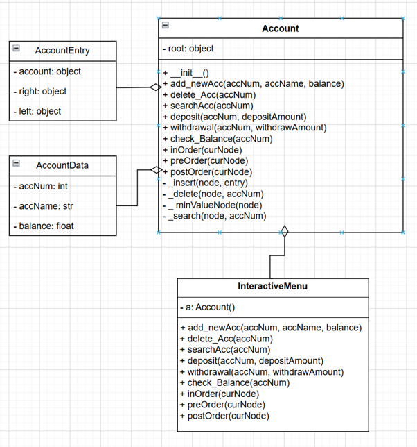
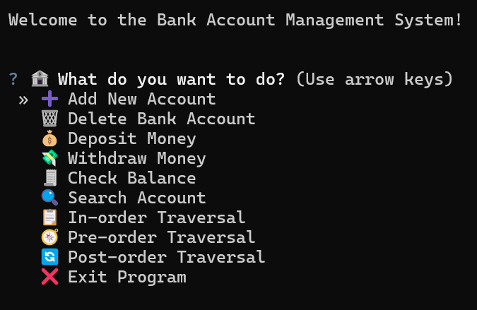
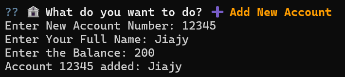
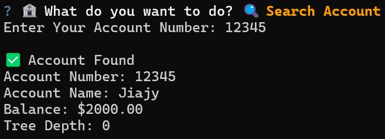
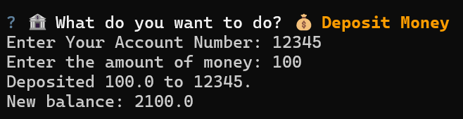
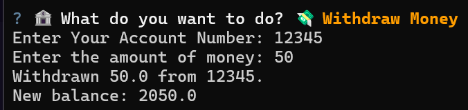
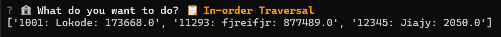
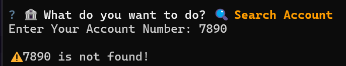

# Bank Account Management System
A console-based bank account management system developed in Python using a Binary Search Tree (BST) data structure. The project demonstrates object-oriented programming, recursion, and algorithm analysis.

## Features
- Create a new bank account
- Delete an existing account
- Deposit money
- Withdraw money
- Search for an account
- Check account balance
- In-order traversal
- Pre-order traversal
- Post-order traversal

## Installation
### Clone the respository
```bash
git clone https://github.com/JiajyStudio/Bank_Account_Management_System.git
cd Bank_Account_Management_System
```
### Install Dependencies
```bash
pip install -r requirements.txt
```
### Run the Project
```bash
python backAccount.py
```

## Data Structure
This project stores bank accounts using a Binary Search Tree to provide efficient searching and insertion.

## Project Structure
- ```bankAccount.py```: Main program and user interface.
- ```accountClasses.py```: Contains the BST implementation and account operations.

## Technologies
- Python
- Object-Oriented Programming (OOP)
- Binary Search Tree (BST)

## UML Diagram


## Preview
### Main Menu

### Add New Account

### Search for Account

### Deposit Money

### Withdraw Money

### Traversal

### Error


## Time Complexity
| Operation | Best Case | Worst Case | Notes |
|-----------|-----------|------------|-------|
| Add Account | O(log n) | O(n) | Insert an account into the BST which compares account numbers to find the correct position. |
| Delete Account | O(log n) | O(n) | Delete an account from the BST, then it will be re-linking nodes depends on child structure. |
| Search Account / Check Balance | O(log n) | O(n) | Finding node by account number, which pure BST search = O(log n) and checking balance = O(1) |
| Deposit / Withdraw | O(log n) | O(n) | This will search the node, the modify the balance, which will search = O(log n) and update = O(1). |
| Display Sorted List | O(n) | O(n) | This complexity works for every type of traversals (in-order, pre-order, post-order), because it has to go through each node every time. So, it causes constant time complexity to travel every node. |
> Note: The average case for BST operations is O(log n), while the worst case is O(n) if the tree becomes unbalanced.

## Testing
The system was tested with 20 test cases covering both successful operations and error handling.

| Category | Test Scenarios |
|----------|----------------|
| Display Accounts | Empty list, successful account list display |
| Add Account | Valid input, duplicate account, blank field |
| Delete Account | Existing account, non-existing account, blank field |
| Search Account | Existing account, non-existing account, blank field |
| Deposit | Valid amount, invalid amount |
| Withdraw | Valid amount, invalid amount |
| Balance Check | Existing account, non-existing account |
| Traversal | In-order, pre-order, post-order traversal |
> Note: All core features were tested, including valid inputs, invalid inputs, duplicate account handling, and empty data scenarios.

## Learning Outcomes
This project helped me practice:
- Object-Oriented Programming
- Recursion
- Binary Search Trees
- Algorithm Time Complexity
- Data Structure implementation

## Future Improvements
- Graphical User Interface (GUI)
- Persistent database storage
- Multi-user authentication

## Author
Onphimol Krurjark